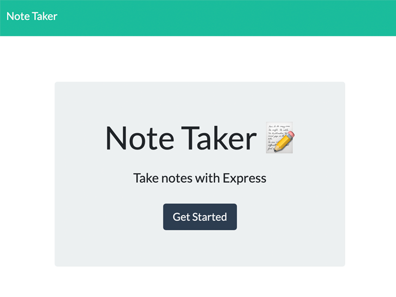
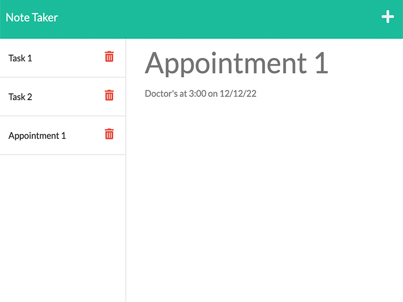

# Note_Taker_Supreme
  
## Description 

  
A simple note taking application that allows the user to organize their thoughts and keep track of tasks they need to do

## Deployed Application
[Heroku](https://arcane-caverns-07543.herokuapp.com/)
  
## Table of Contents
* [Installation](#Installation)
* [Usage](#Usage)
* [License](#License)
* [Questions](#Questions)

## Installation
Clone this repository to your local machine. Open a command line at the root folder of the repository and run `npm install` in order to install all dependencies

  
## Usage
From the command line at the root folder, run either `npm start` or `node server.js`, which will stqart localhost server on PORT 3001. Open your browser and navigate to http://localhost:3001/ to use the application. It can also be used [live on heroku](https://arcane-caverns-07543.herokuapp.com/)

  
  

## License
A short and simple permissive license with conditions only requiring preservation of copyright and license notices. Licensed works, modifications, and larger works may be distributed under different terms and without source code.  
  

## Questions
If you have any questions, concerns, or comments, feel free to contact me:
  
-GitHub: [Zacharycampanelli](https://github.com/Zacharycampanelli)  
-Email: [zaccamp@optonline.net](mailto:zaccamp@optonline.net)
